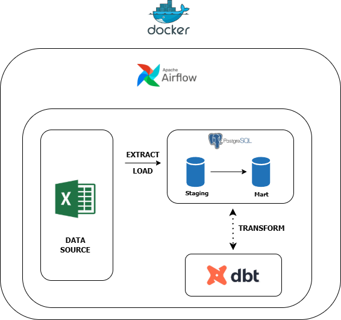
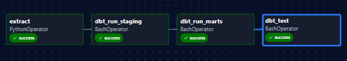
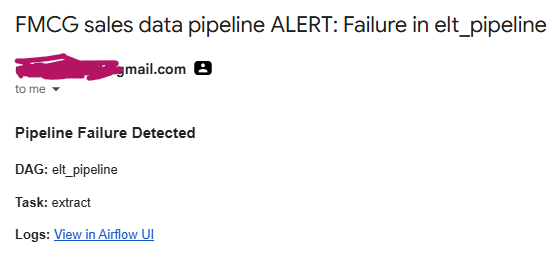

# FMCG Sales Data Pipeline

## Overview

This project is an end-to-end ELT pipeline built using **Python**, **PostgreSQL**, **dbt**, **Apache Airflow**, and **Docker**. It was developed based on a simulated two-year (2024-2025) FMCG sales dataset.

The dataset was provided as a multi-sheet Excel workbook containing transaction data, product information, distributor details, salesperson records, monthly targets, and a date dimension.

The goal of the project was not just to load the data into a database, but to build a reliable pipeline that cleans the data, models it for analytics, orchestrates the workflow, and can be run repeatedly without creating duplicate records.

---

# Tech Stack

* Python
* PostgreSQL
* Apache Airflow
* dbt (Data Build Tool)
* Docker

---

# Solution Architecture

The pipeline follows a simple ELT approach.



Apache Airflow orchestrates the entire workflow, while Docker provides a consistent environment for running every component of the project.

---

# The Pipeline

The extraction process was written in Python.
During each run, the pipeline:

* reads every worksheet from the Excel file.
* applies basic validation and cleaning.
* loads the cleaned data into PostgreSQL.
* uses incremental loading to prevent duplicate records.

The pipeline currently ingests the following tables:

* Transactions
* Products
* Distributors
* Salespersons
* Monthly Targets
* Date

The dataset provided for this assessment was already relatively clean, so only lightweight validation was required during the extraction process.

The pipeline performs the following checks before loading data into PostgreSQL:

- Creates a table only if it does not already exist.
- Preserves existing tables during subsequent pipeline runs.
- Uses an incremental loading approach for the **Transactions** table by appending new transaction records instead of recreating the table.
- Skips loading for dimension tables (Products, Distributors, Salespersons, Targets and Date) once they have been created, since these tables are relatively static in this dataset.

This approach prevents unnecessary table recreation, protects downstream dbt models that depend on the raw tables, and reduces the amount of data processed during subsequent pipeline executions.

---

# Database Design

A simple star schema was used to organise the data.

### Fact Table

* Transactions

### Dimension Tables

* Products
* Distributors
* Salespersons
* Date

The star schema keeps the analytical models simple while making reporting queries easier to write and maintain.

---

# dbt Transformations

The transformation layer was implemented using dbt.

## Staging Models

The staging models closely mirror the raw tables while performing lightweight transformations such as:

* renaming columns where necessary
* casting data types
* basic data cleaning
* preparing the data for downstream models

Keeping these transformations in the staging layer makes the marts easier to understand and maintain.

---

## Mart Models

Two analytical marts were created: mart_sales_performance and mart_distributor_summary.

The sales performance table combines the transaction table with the relevant dimensions to produce a sales-ready dataset. It supports most day-to-day sales reporting requirements and contains:

* Product information
* Salesperson information
* Distributor information
* Revenue
* Gross profit
* Date attributes
* Regional information

The distributor summary provides a simple view for comparing distributor performance across regions. It aggregates distributor performance by calculating:

* Total transactions
* Total revenue
* Total profit
* Average revenue

---

# Apache Airflow

Apache Airflow is responsible for orchestrating the entire pipeline.

The DAG performs the following tasks in sequence:

```text
Extract & Load
      │
      ▼
dbt Staging
      │
      ▼
dbt Mart Models
      │
      ▼
dbt Tests
```


To improve reliability, the DAG includes:

* Task dependencies
* Retry logic
* Email notifications on failure

This ensures that downstream tasks only execute after upstream tasks complete successfully.



---

# Docker

The entire solution is containerized using Docker. Using Docker means the project can be started on any machine without manually installing PostgreSQL, Airflow or dbt.

---

# SQL Business Questions

The repository also contains SQL solutions for the following business questions:

1. Top 5 products by total revenue in 2025.
2. Region with the highest month-over-month revenue growth in Q3 2025.
3. Average target achievement percentage per salesperson.
4. Distributor with the highest return rate.
5. Rolling three-month revenue trend by product category.

The queries are available in:

```text
sql_business_questions.sql
```

---

# Running the Project

### 1. Clone the repository

```bash
git clone <repository-url>
```

### 2. Move into the project directory

```bash
cd fmcg_project
```

### 3. Build the Docker image

```bash
docker compose build
```

### 4. Start the containers

```bash
docker compose up -d
```

### 5. Open Airflow

```
http://localhost:8083
```

### 6. Run the DAG

Trigger the `elt_pipeline` DAG from the Airflow UI.

---

# Future Improvements

Given more time, I would consider the following improvements:

* Add CI/CD using GitHub Actions.
* Implement more comprehensive data quality checks.
* Add automated dbt documentation hosting.
* Introduce logging and monitoring dashboards.
* Store the Excel source file in cloud storage instead of the local project directory.
* Extend the marts to include more business KPIs and historical trend analysis.